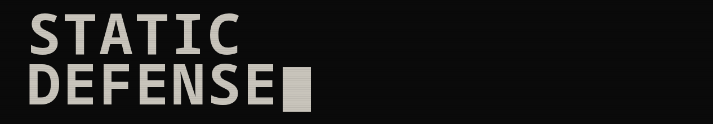
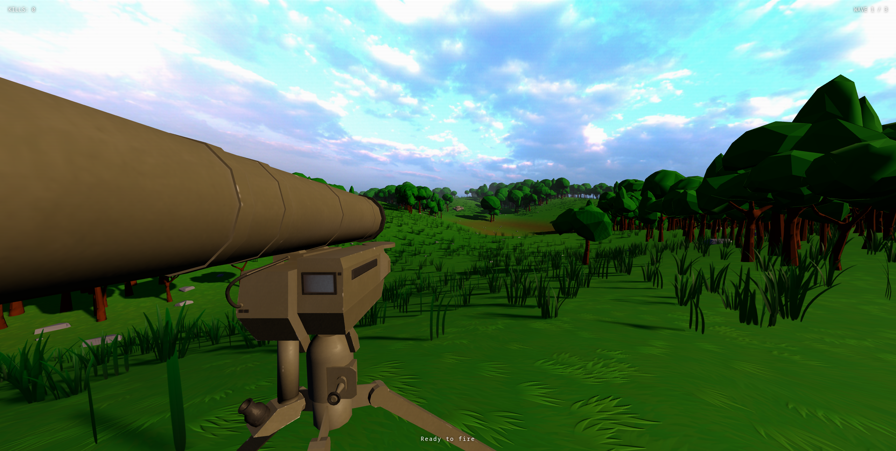
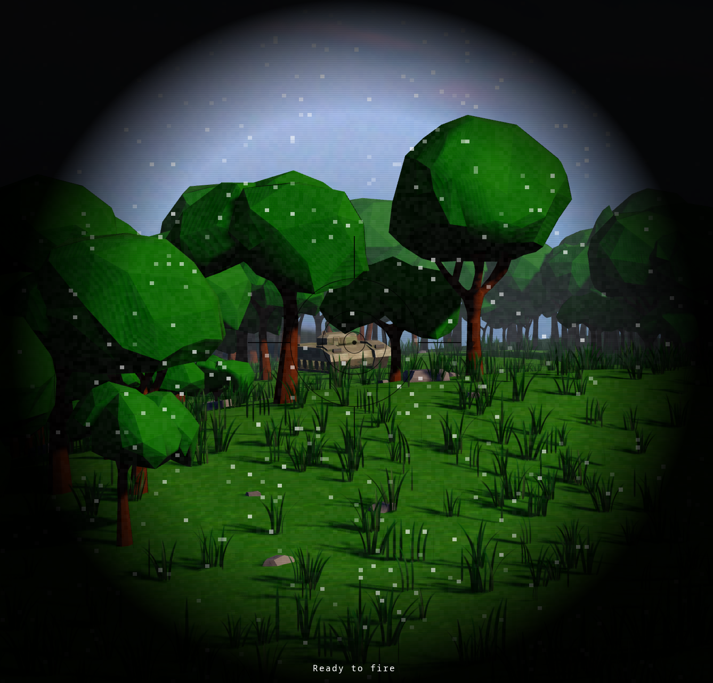
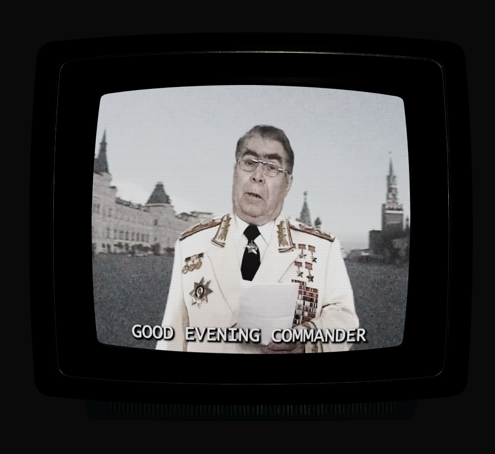
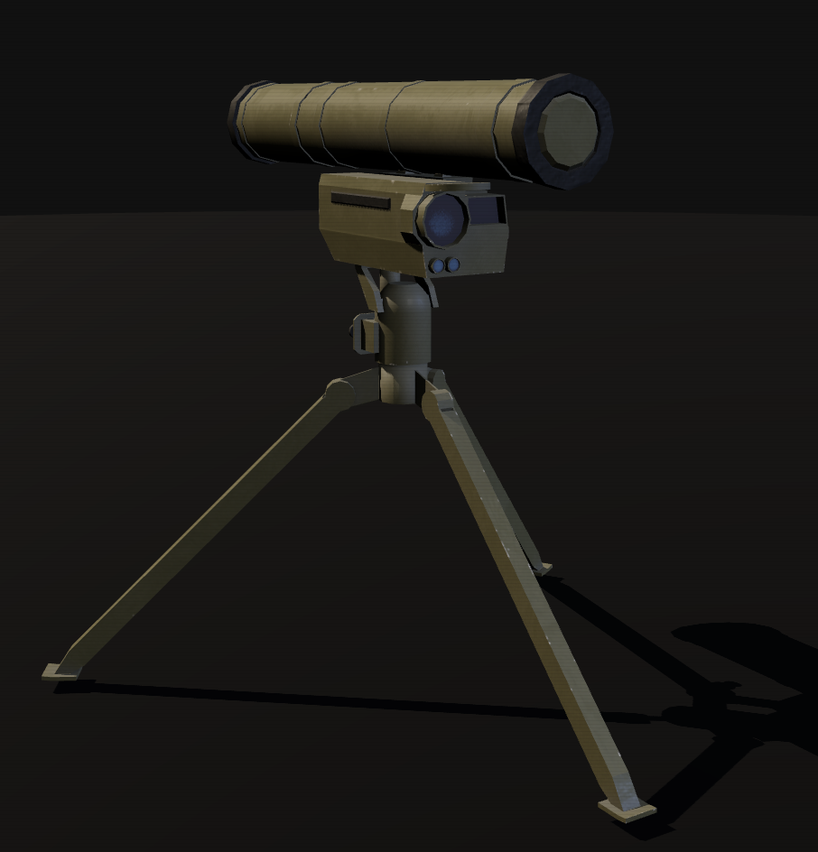
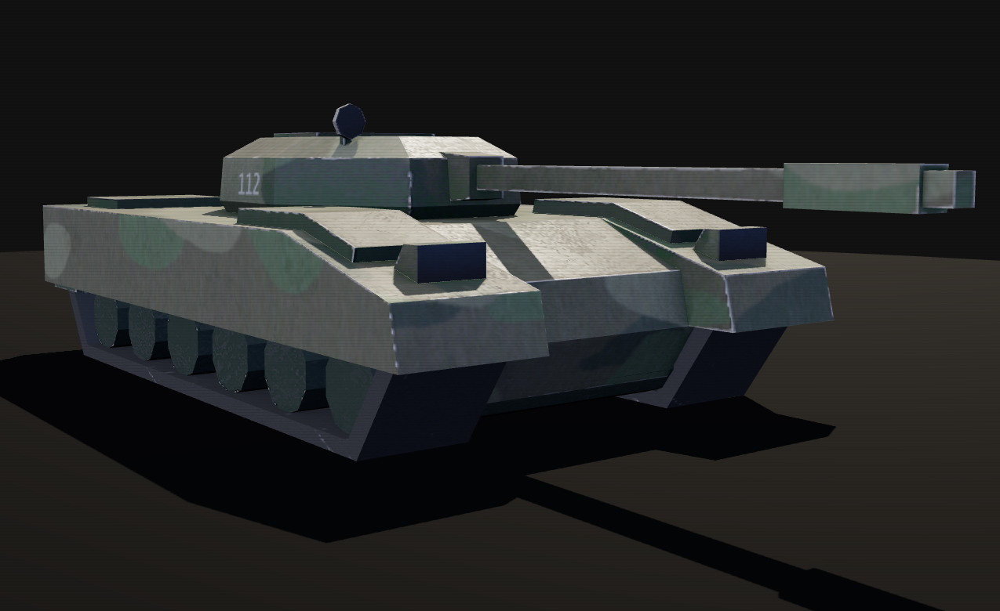
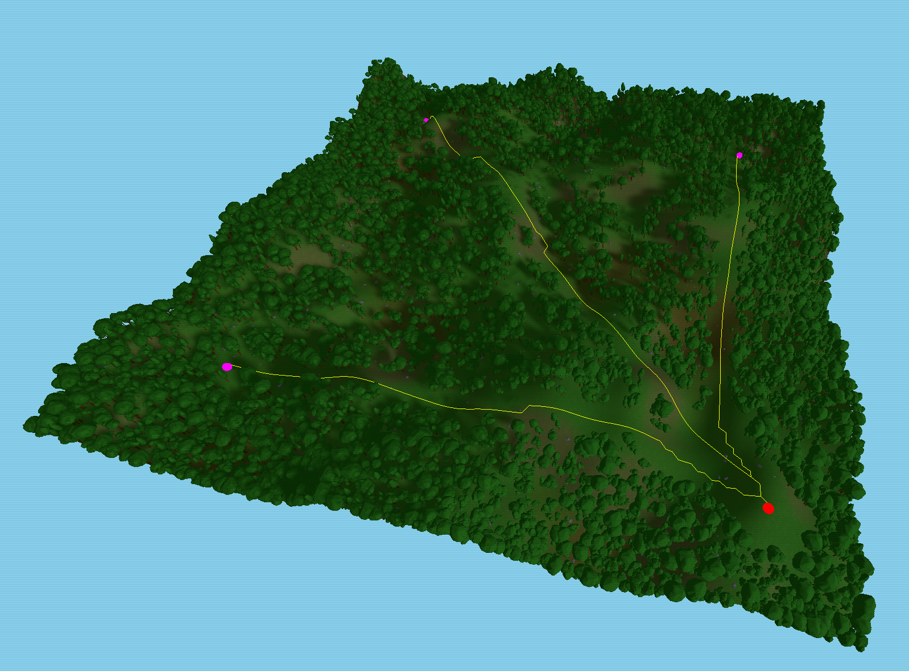
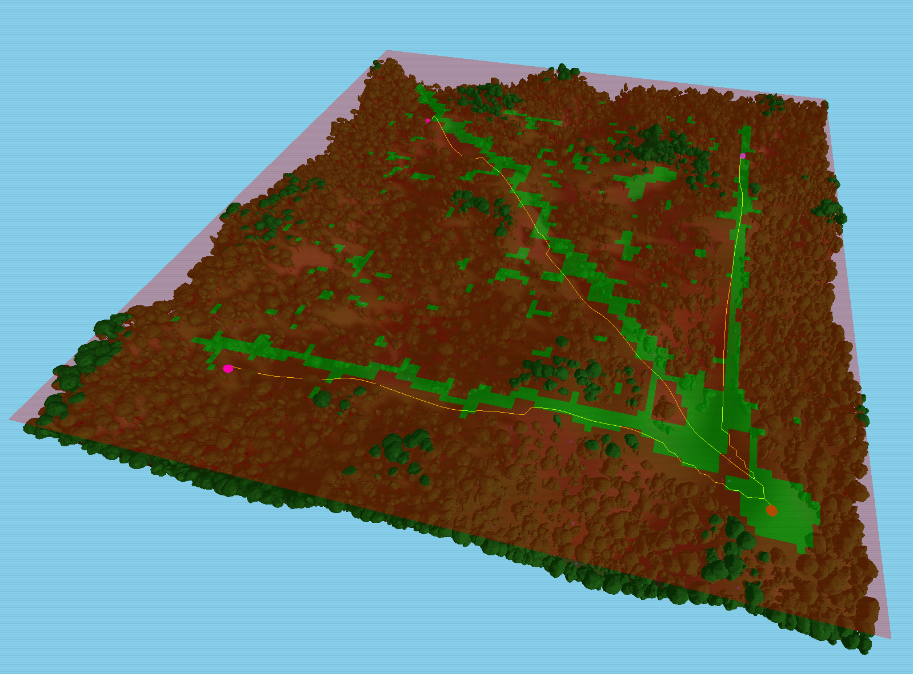

  

  

  Tanks are coming and you are left alone with a 9M133 Kornet. 
  Reload manually between every shot and survive the assault.

---

## How it plays

Three waves of enemy tanks spawn from the map edges and advance toward your position using A* pathfinding. They slow down when hit, catch fire, and eventually cook off. Let any one of them reach you and it's over.

You hold a single static launcher. Rotate it with the mouse, pitch up or down, and fire. Each missile stays under your control after launch, so you guide it to the target. Reloading takes time and plays out as a full animation, so every shot counts.

The map is different every run, generated from simplex noise before the match starts. Size, terrain frequency, and amplitude are all adjustable from the pre-game menu.

   
  A tank is approaching our position

<table width="100%"><tr>
  <td align="center"> The scope allows for precise long-range targeting</td>
  <td align="center"> We received an important communication</td>
</tr></table>

---

## The launcher

The weapon is a 9M133 Kornet, a Russian anti-tank guided missile system. The model and all its textures were handmade in Blender, built from reference images to match the launcher's silhouette within a low-poly budget.

<table width="100%"><tr>
  <td align="center"> In-game model</td>
  <td align="center"> Real 9M133 Kornet</td>
</tr></table>

---

## The enemy

The enemy tank started as a model downloaded from Sketchfab, then edited in Blender to fit the game's needs. The textures were created from scratch. The result does not represent any specific vehicle but loosely takes after Soviet-era tank aesthetics in shape and proportion.

  

---

## Terrain generation

The map is built from two octaves of simplex noise, quantized into discrete height steps for a stylized look. Vertex colors are blended per-vertex from height and slope: flat ground stays green, low depressions go brown, steep faces turn rocky. Enemy spawn positions, protected nav corridors, and the launcher placement are all derived from the final heightmap.

Every run is different. Size, frequency, and amplitude are exposed in the pre-game menu.

<table width="100%"><tr>
  <td align="center" width="50%"> Procedurally generated terrain</td>
  <td align="center" width="50%"> A* navigation grid overlay</td>
</tr></table>

---

## Controls

| Input | Action |
|:---|:---|
| `← →` | Rotate launcher |
| `↑ ↓` | Elevate gun |
| `RMB` | Toggle scope |
| `LMB` | Fire (scoped only) |
| `R` | Reload |
| `Click` | Lock pointer |

---

## Debug scenes

The scene selector includes additional scenes for isolated testing:

| Scene | Description |
|:---|:---|
| Terrain | Live sliders for size, frequency, amplitude, and clutter density. Navmap overlay toggle. |
| Launcher | Full launcher controls, no terrain. Six tanks spawn at staggered distances. |
| Tank | Single tank in a fixed point, for hitbox and behavior inspection. |
| TV | The intro TV prop in isolation. |
| Model Viewer | Orbit any model. Cycles through all props, supports wireframe toggle and camera reset. |

---

## Credits

| Asset | Source |
|:---|:---|
| Tree models | [Sketchfab](https://sketchfab.com/3d-models/free-simple-lowpoly-trees-3d-models-852b73cc6827491681ac56431e790746) |
| Tank model (base) | [Sketchfab](https://sketchfab.com/3d-models/low-poly-tank-308346f4741a48018c93ebe6f8e53905) |
| TV model | [Sketchfab](https://sketchfab.com/3d-models/portable-tv-set-a8e4e31aa9a0439892b0b32a38a0fa3b) |
| Grass models | [Sketchfab](https://sketchfab.com/3d-models/stylized-grass-3a5a5c5be677403d9f56e451cd3dd4af) |
| Rock models | [Sketchfab](https://sketchfab.com/3d-models/rock-low-poly-2c88f234671c4aceb6a6449270b168b0) |
| Grass terrain texture | [freestylized.com](https://freestylized.com/material/grass_01/) |
| Sky textures | [Poly Haven](https://polyhaven.com/) |
| Sounds | [Pixabay](https://pixabay.com/users/freesound_community-46691455/) |

---

  <b>Lorenzo Carlini 1883140</b> &nbsp;·&nbsp; Interactive Graphics, Sapienza 2025–2026

